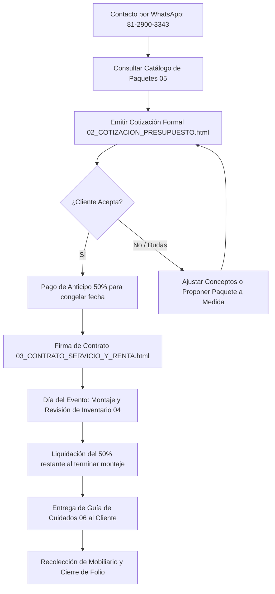

# Centro de Documentación y Gestión Institucional
## Nancy García Decoración · Globos · Detalles

Bienvenido a la suite oficial de documentación comercial, legal, operativa y de diseño de **Nancy García Decoración · Globos · Detalles**.

Esta carpeta contiene todos los formatos, manuales y herramientas imprimibles para la operación profesional de la empresa en Monterrey y su Área Metropolitana.

---

### 📂 Estructura de la Carpeta de Documentos

| Archivo | Formato | Propósito / Uso |
| :--- | :---: | :--- |
| [01_MANUAL_DE_IDENTIDAD_Y_ESTILO.md](file:///c:/Users/sergi/MisArchivosLocales/Balloons%20Mty%20CADY/documentos/01_MANUAL_DE_IDENTIDAD_Y_ESTILO.md) | Markdown | Manual de identidad visual, paleta cromática (Rosa Metálico `#C85BA3`, Turquesa Neón `#00F5D4`), tipografías (`Outfit`, `Plus Jakarta Sans`), isotipo del perrito de globo y reglas del membrete. |
| [02_COTIZACION_PRESUPUESTO.html](file:///c:/Users/sergi/MisArchivosLocales/Balloons%20Mty%20CADY/documentos/02_COTIZACION_PRESUPUESTO.html) | HTML Imprimible | Plantilla de cotización formal con membrete vectorial oficial, campos editables en tiempo real, desglose de servicios, cálculo de anticipo del 50% y botón para imprimir o guardar como PDF (`Ctrl + P`). |
| [03_CONTRATO_SERVICIO_Y_RENTA.html](file:///c:/Users/sergi/MisArchivosLocales/Balloons%20Mty%20CADY/documentos/03_CONTRATO_SERVICIO_Y_RENTA.html) | HTML Imprimible | Contrato legal de prestación de servicios y renta de mobiliario (caballetes, banquitos, cilindros, mamparas), con cláusulas de responsabilidad, clima en Monterrey y firmas de conformidad. |
| [04_HOJA_ENTREGA_Y_RECEPCION.html](file:///c:/Users/sergi/MisArchivosLocales/Balloons%20Mty%20CADY/documentos/04_HOJA_ENTREGA_Y_RECEPCION.html) | HTML Imprimible | Hoja de control operativo de campo para verificar inventario físico al entregar en el salón/festejo y al recoger el material. |
| [05_CATALOGO_PAQUETES_Y_TARIFARIO.md](file:///c:/Users/sergi/MisArchivosLocales/Balloons%20Mty%20CADY/documentos/05_CATALOGO_PAQUETES_Y_TARIFARIO.md) | Markdown | Catálogo comercial con los 3 paquetes estrella (*Fiesta Creativa*, *Escenografía Mágica*, *Celebración Total VIP*), precios unitarios por concepto y costos de flete por municipio. |
| [06_GUIA_CUIDADO_GLOBOS_Y_EVENTOS.md](file:///c:/Users/sergi/MisArchivosLocales/Balloons%20Mty%20CADY/documentos/06_GUIA_CUIDADO_GLOBOS_Y_EVENTOS.md) | Markdown | Recomendaciones para clientes sobre cómo proteger los globos del sol, calor de Nuevo León, traslados en coche y uso seguro de los caballetes infantiles. |
| [index.html](file:///c:/Users/sergi/MisArchivosLocales/Balloons%20Mty%20CADY/documentos/index.html) | Dashboard Web | Portal administrativo interactivo con acceso rápido en un solo clic a todos los documentos y plantillas. |

---

### 🔄 Flujo Operativo y Comercial Recomendado

---

### 🖨️ Instrucciones de Impresión y Generación de PDF

1. Abre cualquiera de las plantillas `.html` (`02`, `03` o `04`) con tu navegador de preferencia (Chrome, Edge, Firefox).
2. Haz clic sobre cualquier texto, nombre, fecha o monto para editarlo al momento gracias a la función `contenteditable`.
3. Haz clic en el botón superior **"Imprimir o Guardar PDF"** (o presiona `Ctrl + P`).
4. En el diálogo de impresión de tu navegador:
   * **Destino:** *Guardar como PDF* (o tu impresora física).
   * **Diseño:** *Vertical*.
   * **Gráficos en segundo plano:** *Activado* (para mostrar los colores y degradados corporativos).
